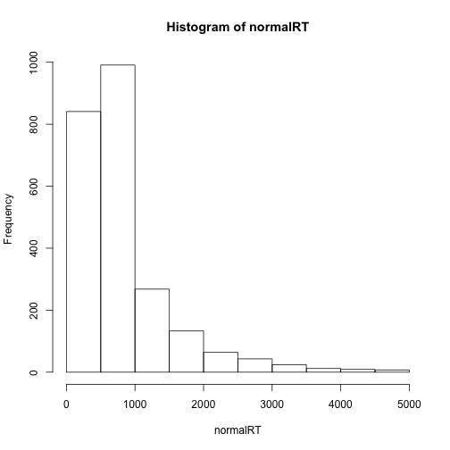
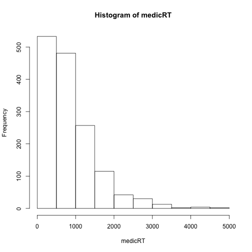

组会报告
========================================================
author: 夏骁凯
date: 2016年12月07日
autosize: true

完成任务
========================================================

- 实验数据的分析
- 近红外实验室在线预约系统的搭建
- 认知控制功能大会的知识整理

实验数据的分析
===============
- 整理与准备数据
- 行为数据分析
- 近红外数据分析

数据整理与准备
===========
函数的编写
前期数据整理(代码已隐藏)


对数据进行描述统计
==========

```r
normal <- filter(StimResult, No. < 30)
medicial <- filter(StimResult, No. > 30)
```

1. 反应时的描述统计
===========

```r
library(psych)
normalRT <- normal$RT[normal$RT != 0]
medicRT <- medicial$RT[medicial$RT != 0]
describe(normalRT)
```

```
   vars    n   mean     sd median trimmed    mad min  max range skew
X1    1 2392 834.67 683.31    621  700.77 357.31   2 4978  4976 2.46
   kurtosis    se
X1     7.53 13.97
```

```r
describe(medicRT)
```

```
   vars    n   mean     sd median trimmed    mad min  max range skew
X1    1 1479 873.78 661.06    669  767.17 474.43   4 4929  4925 1.84
   kurtosis    se
X1     4.58 17.19
```

反应时的分布
=========

```r
hist(normalRT)
```


*****

```r
hist(medicRT)
```



2. 被试选择疼痛程度分数的描述统计
==========

```r
describe(normal$RESP)
```

```
   vars    n mean sd median trimmed  mad min max range skew kurtosis   se
X1    1 2375 3.07  2      3    2.84 2.97   1   8     7 0.74     -0.5 0.04
```

```r
describe(medicial$RESP)
```

```
   vars    n mean   sd median trimmed  mad min max range skew kurtosis
X1    1 1479 3.05 2.11      2    2.79 1.48   1   8     7 0.75     -0.7
     se
X1 0.05
```

疼痛程度
